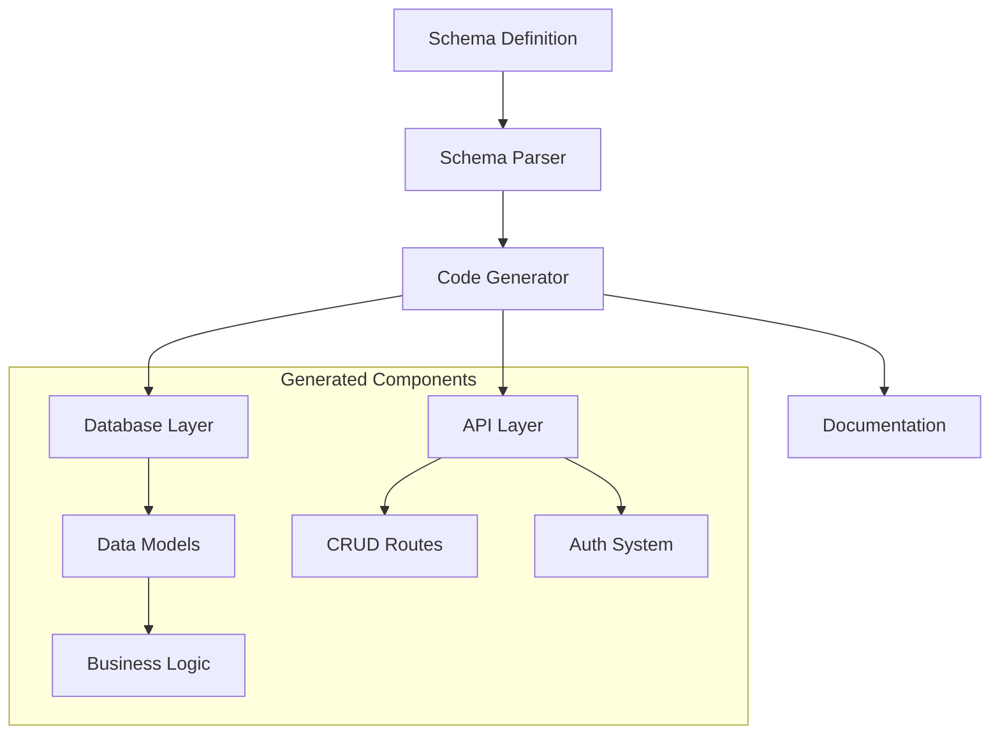
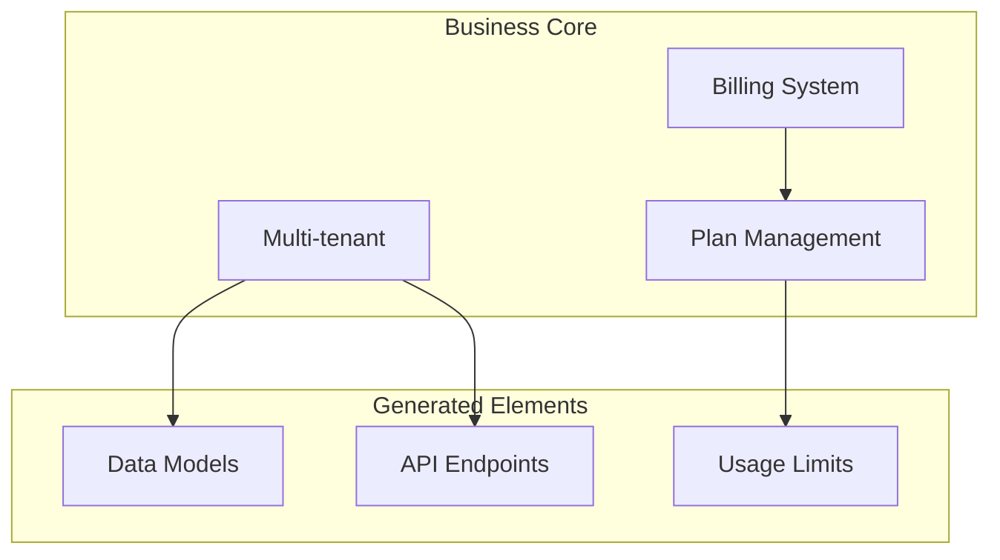

# Schema-First API Boilerplate Generator

## Core Vision

Generate production-ready API servers by starting with data schemas. Developers define their business models first, and the system generates everything else - from database setup to API endpoints, documentation, and SaaS infrastructure.

## System Architecture

### Data Flow



### SaaS Components (Optional)



## Input Structure

### 1. Schema Definition

```yaml
models:
  user:
    fields:
      name: string
      email: string
      role: enum[admin, user]
    auth: true
    relations:
      orders: hasMany

  product:
    fields:
      name: string
      price: decimal
      inventory: integer
    search: true
    audit: true

  order:
    fields:
      status: enum[pending, completed]
      total: decimal
    relations:
      user: belongsTo
      products: hasMany
    triggers:
      - onUpdate: checkInventory
```

### 2. API Configuration

```yaml
api:
  auth: jwt
  database: postgresql
  features:
    search: true
    export: true
    audit: true

saas:
  enabled: true
  billing: stripe
  tenancy: multi-tenant
```

## Generated Output

### 1. Core Components

The generator produces a complete database schema along with necessary migrations to ensure that the database structure aligns with the defined models. It automatically creates CRUD (Create, Read, Update, Delete) endpoints for all models, allowing developers to interact with the data seamlessly. Authentication and authorization mechanisms are built-in, ensuring that only authorized users can access specific resources. Additionally, the system supports search and filtering capabilities, enabling users to retrieve data efficiently based on various criteria. Data validation is implemented to maintain data integrity, ensuring that only valid data is stored in the database. Finally, comprehensive error handling is included to manage and respond to any issues that may arise during API interactions, providing clear feedback to developers and users alike.

### 2. SaaS Features (Optional)

For applications that require multi-tenancy, the generator includes a robust multi-tenant system that allows multiple clients to share the same application while keeping their data isolated. Billing integration is provided, enabling seamless payment processing through platforms like Stripe. The system also incorporates usage tracking to monitor resource consumption and enforce limits based on subscription plans. Plan management features allow administrators to create and manage different subscription tiers, ensuring that users have access to the appropriate resources based on their chosen plan. Additionally, feature flags can be implemented to enable or disable specific functionalities for different user groups, providing flexibility in feature rollout and testing.

### 3. Developer Tools

To enhance the developer experience, the generator produces comprehensive API documentation that outlines all available endpoints, request/response formats, and usage examples. Test suites are automatically generated to ensure that the API behaves as expected, facilitating easier debugging and validation. Monitoring setup is included to track application performance and usage metrics, allowing developers to identify and address potential issues proactively. Finally, deployment configurations are provided to streamline the process of deploying the application to various environments, ensuring a smooth transition from development to production.

## Extension Points

1. Custom Business Logic
2. Custom Routes
3. Middleware
4. Event Handlers
5. Validators
6. Access Control Rules

## Key Features

### 1. Schema-Based Generation

- Automatic CRUD operations
- Relationship handling
- Data validation
- Type safety
- Database optimizations

### 2. Built-in Patterns

- Authentication flows
- Rate limiting
- Caching strategies
- Error handling
- Audit logging

### 3. SaaS Essentials

- Multi-tenancy
- Billing integration
- Usage tracking
- Plan management
- Feature flags

### 4. Developer Experience

- Clear documentation
- Type definitions
- Testing setup
- Monitoring
- Deployment guides

## Development Flow

1. Define data schema
2. Configure API features
3. Generate base code
4. Add custom business logic
5. Test and deploy

## Future Considerations

1. Schema evolution and migrations
2. Custom template support
3. Plugin system
4. Visual schema builder
5. Performance optimization tools
