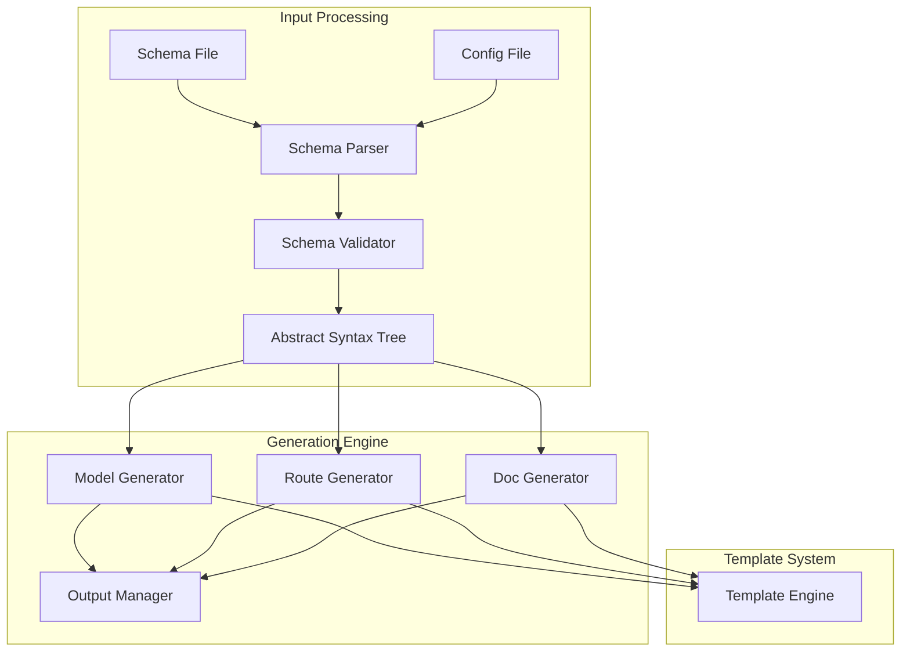

# Implementation Strategy

## Core Architecture

## Implementation Steps

### 1. Core Engine (Phase 1)

- Schema parser
- Configuration validator
- AST generator
- Template engine
- File generator

### 2. Code Generators (Phase 2)

- Database models/migrations
- Basic CRUD routes
- Authentication system
- Documentation generator
- Test suite generator

### 3. SaaS Features (Phase 3)

- Multi-tenancy
- Billing integration
- Usage tracking
- Plan management

## Key Technical Decisions

### 1. Parser Implementation

- Use a declarative parser (like ANTLR or Pest)
- Support YAML/JSON input
- Strong type validation
- Schema versioning

### 2. Template System

- Use MiniJinja templating engine
- Support partial templates
- Allow template overrides
- Enable custom templates

### 3. Extension System

- Plugin architecture
- Hook system
- Custom generators
- Middleware support

## Development Phases

### Phase 1: Core Infrastructure

1. Schema parser development
2. Basic code generation
3. File system management
4. Template system

### Phase 2: Base Features

1. Database layer
2. CRUD operations
3. Authentication
4. Documentation

### Phase 3: Advanced Features

1. Relationships
2. Validation
3. Custom logic
4. Tests

### Phase 4: SaaS Features

1. Multi-tenancy
2. Billing
3. Usage tracking
4. Plan management

## Technical Stack Considerations

### Parser & Template Engine

- Rust for core implementation
- MiniJinja for template processing
- Strong type system
- Fast execution

### Selected Stack:

**Rust with MiniJinja** has been chosen for:

- Performance-focused template processing
- Sandboxed template execution
- Compatible Jinja2-like syntax
- Strong compile-time guarantees
- Excellent error handling
- Zero-cost abstractions

Benefits:

1. Fast execution
2. Strong type safety
3. Single binary
4. Easy distribution
5. Secure template processing
6. Familiar template syntax for users

### Extension System

- Plugin architecture
- Hook system
- Custom generators
- Middleware support

## Initial Development Plan

1. **Week 1-2: Core Parser**

   - Schema definition
   - Validation
   - AST generation

2. **Week 3-4: Template Engine**

   - Base templates
   - Output generation
   - File management

3. **Week 5-6: Code Generators**

   - Model generation
   - Route generation
   - Basic docs

4. **Week 7-8: Basic Features**
   - CRUD operations
   - Authentication
   - Testing

This approach allows for:

- Early testing
- Incremental development
- Easy extension
- Community contribution
